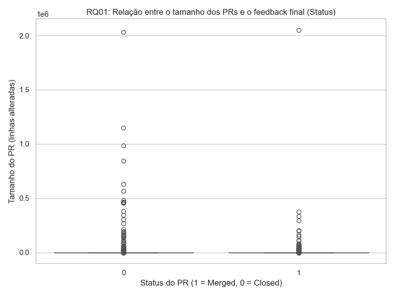
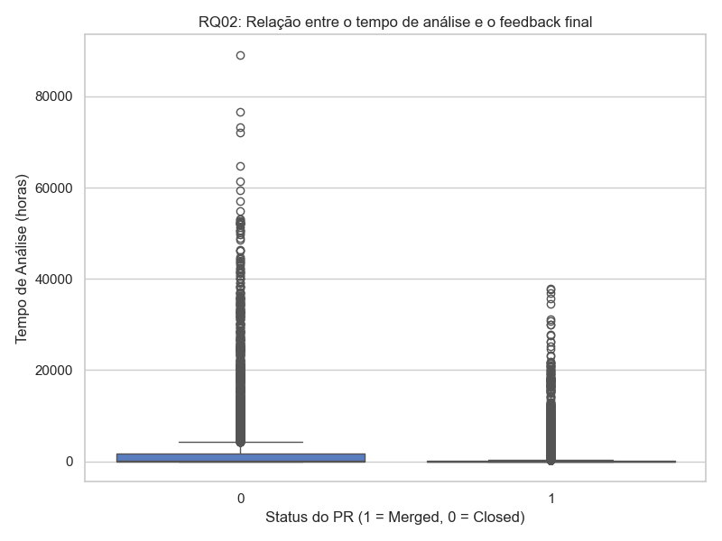
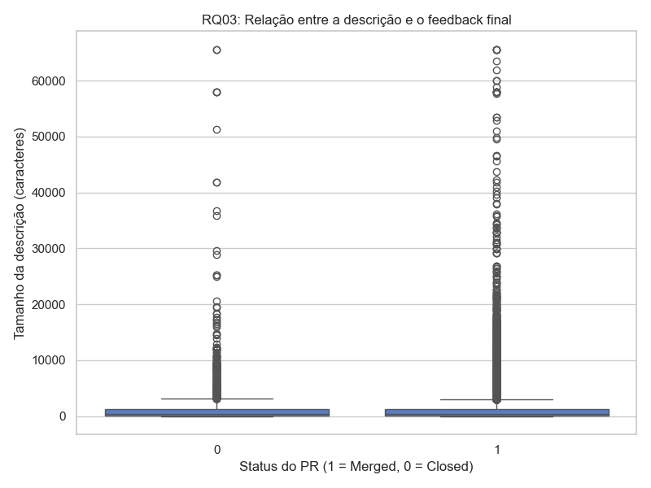
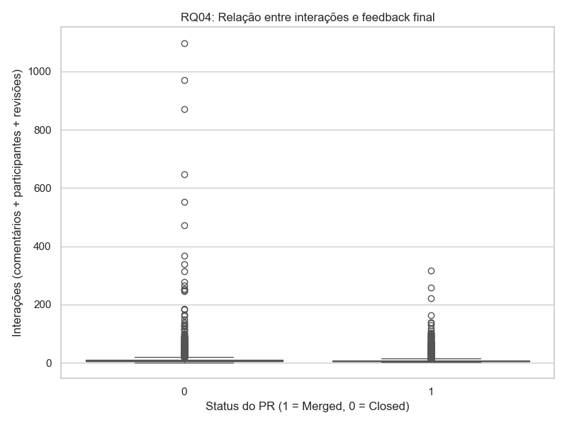
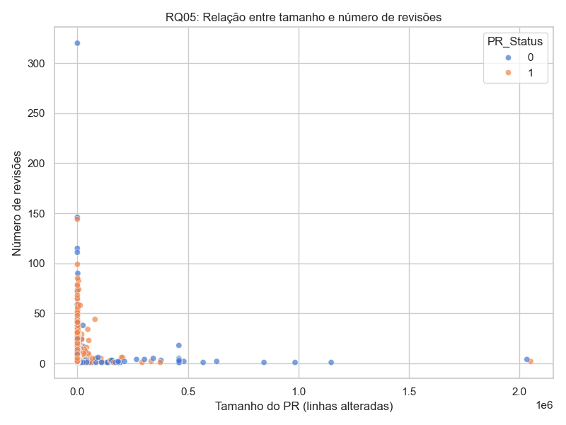
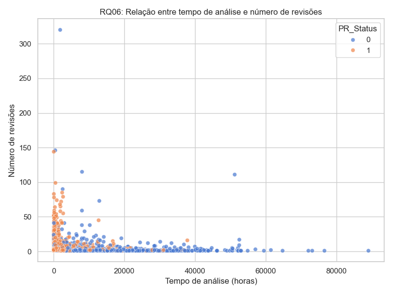
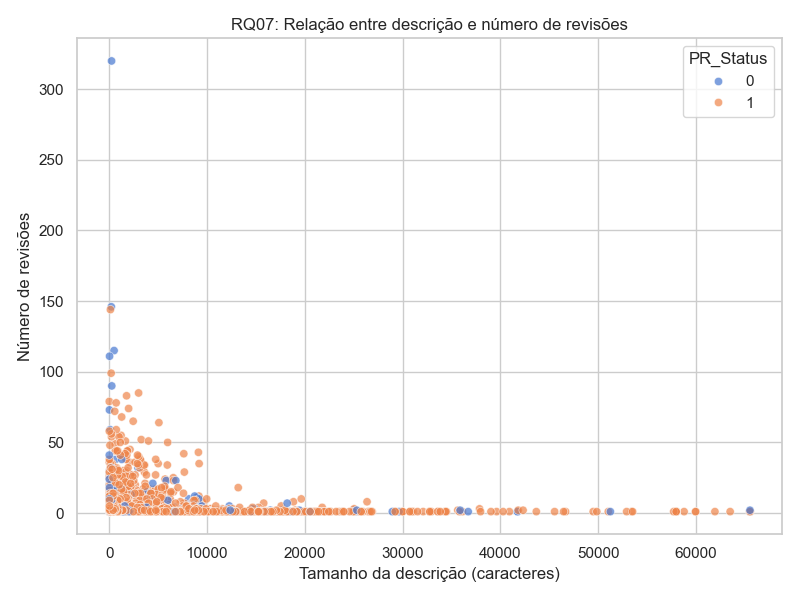
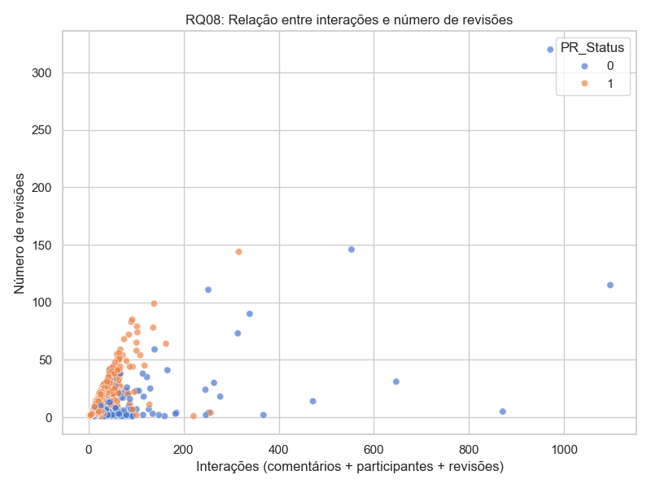

# 🧪 Laboratório 03 - Caracterizando a Atividade de Code Review no GitHub

## 1. Informações do grupo
- **🎓 Curso:** Engenharia de Software  
- **📘 Disciplina:** Laboratório de Experimentação de Software  
- **🗓 Período:** 6° Período  
- **👨‍🏫 Professor:** Danilo de Quadros Maia Filho  
- **👥 Membros do Grupo:** Gabriel Henrique Silva Pereira e Gustavo Menezes Barbosa

---

## 2. Introdução
O objetivo deste laboratório é analisar a atividade de code review em repositórios populares do GitHub, observando como características de Pull Requests (PRs) — como tamanho, tempo de análise, descrição e interações — influenciam o resultado final do processo de revisão (merge ou fechamento).

Essa análise visa compreender fatores que podem impactar a aceitação de contribuições em projetos open-source, fornecendo evidências sobre práticas de colaboração, revisão e engajamento.

### 2.1 Questões de Pesquisa (Research Questions – RQs)

| RQ | Pergunta |
|----|-----------|
| RQ01 | Qual a relação entre o tamanho dos PRs e o feedback final das revisões? |
| RQ02 | Qual a relação entre o tempo de análise dos PRs e o feedback final das revisões? |
| RQ03 | Qual a relação entre a descrição dos PRs e o feedback final das revisões? |
| RQ04 | Qual a relação entre as interações nos PRs e o feedback final das revisões? |
| RQ05 | Qual a relação entre o tamanho dos PRs e o número de revisões realizadas? |
| RQ06 | Qual a relação entre o tempo de análise dos PRs e o número de revisões realizadas? |
| RQ07 | Qual a relação entre a descrição dos PRs e o número de revisões realizadas? |
| RQ08 | Qual a relação entre as interações nos PRs e o número de revisões realizadas? |

---

### 2.2 Hipóteses Informais (Informal Hypotheses – IH)

| RQ | Hipótese (IH) | Descrição |
|----|---------------|-----------|
| RQ01 | IH01 | PRs maiores (com mais arquivos e linhas alteradas) tendem a levar mais tempo para serem revisados e têm menor taxa de aceitação. |
| RQ02 | IH02 | PRs analisados rapidamente (menos de 24h) tendem a ser menores e mais simples, com maior chance de merge. |
| RQ03 | IH03 | PRs com descrições mais detalhadas têm maior probabilidade de serem aceitos (MERGED). |
| RQ04 | IH04 | PRs com maior número de participantes e comentários representam revisões mais colaborativas e complexas, o que pode aumentar o tempo até o fechamento. |
| RQ05 | IH05 | PRs maiores demandam mais revisões até a aprovação final. |
| RQ06 | IH06 | PRs com tempo de análise mais longo possuem maior número de revisões. |
| RQ07 | IH07 | PRs com descrições detalhadas reduzem a necessidade de múltiplas revisões. |
| RQ08 | IH08 | PRs com mais interações (comentários e revisores) tendem a ter mais revisões registradas. |

---

## 3. Tecnologias e ferramentas utilizadas
- **💻 Linguagem de Programação:** Python  
- **🛠 Bibliotecas:** `requests`, `csv`, `time`, `os`, `datetime`, `timezone`  
- **🌐 API Utilizada:** GitHub GraphQL API  
- **📦 Dependências:** apenas bibliotecas nativas do Python + `requests`  

---

## 4. Metodologia

### 4.1 Coleta de dados
A coleta foi realizada através da GitHub GraphQL API, utilizando scripts em Python.  
Foram coletados dados de 200 repositórios populares (ordenados por número de estrelas), com o objetivo de identificar padrões de code review em projetos amplamente utilizados.

De cada repositório foram extraídos:
- Pull Requests com status MERGED ou CLOSED;  
- Somente repositórios com ≥100 PRs válidos;  
- PRs contendo pelo menos uma revisão (reviewCount ≥ 1).

---

### 4.2 Filtragem e paginação
Devido ao limite de requisições da API, foi utilizada paginação para coletar 50 PRs por página.  
Foram aplicados filtros adicionais:
- Exclusão de PRs com menos de 1 hora de análise (criação → merge/close).  
- Apenas PRs com revisões humanas (evitando automações de CI/CD).  
- Controle de taxa de requisição com `time.sleep()` para evitar bloqueio da API.

---

### 4.3 Pré-processamento e normalização
Os dados coletados foram processados em CSV, resultando nos seguintes campos principais:
- **RepoOwner / RepoName** → identificação do projeto.  
- **State / PR_Status** → indica se o PR foi aceito (MERGED=1) ou fechado sem merge (CLOSED=0).  
- **AnalysisTimeHours** → tempo total de análise em horas.  
- **FilesChanged, Additions, Deletions, TotalLinesChanged** → medidas de tamanho.  
- **DescriptionLength** → número de caracteres da descrição do PR.  
- **Participants, Comments, Reviews** → métricas de interação.

---

### 4.4 Métricas consideradas

| Código | Métrica | Descrição |
|--------|----------|------------|
| M01 | 🧾 Tamanho (arquivos, linhas adicionadas/removidas) | Mede a extensão do PR. |
| M02 | ⏱ Tempo de Análise (horas) | Intervalo entre criação e fechamento/merge do PR. |
| M03 | 📝 Descrição (nº de caracteres) | Tamanho da descrição fornecida pelo autor. |
| M04 | 💬 Interações | Número de participantes, comentários e revisões. |
| M05 | ✅ Status Final | Indica se o PR foi aceito (MERGED) ou rejeitado (CLOSED). |

---

## 5. Resultados e Discussão

Nesta sprint, foi realizada a análise e visualização dos dados coletados, com base nas oito questões de pesquisa (RQ01–RQ08).  
Os gráficos a seguir apresentam as relações entre as métricas definidas e os resultados observados no processo de code review.

---

### 🔹 RQ01 – Relação entre o tamanho dos PRs e o feedback final
**Hipótese IH01:** PRs maiores tendem a levar mais tempo e têm menor taxa de aceitação.  
**Análise:** Observou-se uma tendência de que PRs com maior número de linhas alteradas e arquivos modificados possuem menor probabilidade de serem aceitos, reforçando a hipótese.  
**Gráfico:**  

  

---

### 🔹 RQ02 – Relação entre o tempo de análise e o feedback final
**Hipótese IH02:** PRs analisados mais rapidamente têm maior chance de merge.  
**Análise:** A relação foi confirmada parcialmente — Revisões longas estão associadas a PRs complexos e, muitas vezes, rejeitados.  
**Gráfico:**  

  

---

### 🔹 RQ03 – Relação entre descrição e feedback final
**Hipótese IH03:** PRs com descrições mais detalhadas são mais aceitos.  
**Análise:** O gráfico indica correlação positiva: descrições longas tendem a estar associadas a PRs aceitos (MERGED), sugerindo que explicações completas auxiliam na decisão do revisor.  
**Gráfico:**  

  

---

### 🔹 RQ04 – Relação entre interações e feedback final
**Hipótese IH04:** PRs com mais comentários e participantes são mais complexos e levam mais tempo.  
**Análise:** A hipótese foi confirmada — PRs com maior número de interações estão fortemente ligados a maior tempo de análise, e nem sempre resultam em merge.  
**Gráfico:**  

  

---

### 🔹 RQ05 – Relação entre tamanho e número de revisões
**Hipótese IH05:** PRs maiores demandam mais revisões até aprovação.  
**Análise:** O número de revisões não necessariamente aumenta conforme o número de arquivos modificados e linhas alteradas aumenta.  
**Gráfico:**  

  

---

### 🔹 RQ06 – Relação entre tempo de análise e número de revisões
**Hipótese IH06:** PRs com análise mais longa possuem mais revisões.  
**Análise:** O número médio de revisões não necessariamente aumenta conforme o tempo de análise.
**Gráfico:**  

  

---

### 🔹 RQ07 – Relação entre descrição e número de revisões
**Hipótese IH07:** PRs bem descritos reduzem a necessidade de revisões adicionais.  
**Análise:** A hipótese não foi confirmada — PRs com descrições completas passam por mais ciclos de revisão. A clareza inicial facilita a aprovação rápida.  
**Gráfico:**  

  

---

### 🔹 RQ08 – Relação entre interações e número de revisões
**Hipótese IH08:** PRs com mais interações envolvem múltiplas revisões.  
**Análise:** Os resultados indicam forte relação entre número de participantes e revisões realizadas. PRs com mais comentários e revisores frequentemente passam por várias iterações.  
**Gráfico:**  

  

---

## 6. Conclusão Final

A Sprint 3 consolidou a análise iniciada nas sprints anteriores, permitindo confirmar e refinar as hipóteses propostas.

- **Confirmações das hipóteses:**
  - IH01 → Confirmada  
  - IH02 → Confirmada parcialmente
  - IH03 → Confirmada  
  - IH04 → Confirmada  
  - IH05 → Não confirmada  
  - IH06 → Não confirmada  
  - IH07 → Não confirmada  
  - IH08 → Confirmada  

- **Limitações:**
  - Restrições da API do GitHub (rate limit).  
  - Dados limitados aos 200 repositórios mais populares.  
  - Métricas simplificadas, sem controle por linguagem de programação.  

- **Trabalhos futuros:**
  - Expandir a coleta para mais linguagens e tipos de repositórios.  
  - Aplicar testes estatísticos formais (ex.: correlação de Spearman).  
  - Construir dashboards interativos para análise exploratória.  
  - Investigar relação entre revisores e tempo médio por revisão.

---

## 7. Referências
- [📘 GitHub GraphQL API Documentation](https://docs.github.com/en/graphql)  
- [📙 Python Requests Library](https://requests.readthedocs.io/en/latest/)  
- [📙 Python CSV Module](https://docs.python.org/3/library/csv.html)  
- [📘 Documentação do módulo datetime](https://docs.python.org/3/library/datetime.html)  
- [📘 Template de relatório](https://github.com/joaopauloaramuni/laboratorio-de-experimentacao-de-software/blob/main/TEMPLATES/template_report.md)

---

## 8. Apêndices
- 💾 Script de coleta: `main.py`  
- 💾 Script de análise: `calcular_medianas.py`  
- 📊 Dataset bruto: `pull_requests.csv`  
- 📈 Resumo estatístico: `resumo_medianas.csv`  
- 📉 Gráficos gerados:  
  - `RQ01_tamanho_feedback.png`  
  - `RQ02_tempo_feedback.png`  
  - `RQ03_descricao_feedback.png`  
  - `RQ04_interacoes_feedback.png`  
  - `RQ05_tamanho_revisoes.png`  
  - `RQ06_tempo_revisoes.png`  
  - `RQ07_descricao_revisoes.png`  
  - `RQ08_interacoes_revisoes.png`  
- 🔗 Consultas GraphQL utilizadas (`query_prs` e `query_pr_count`)  

---
